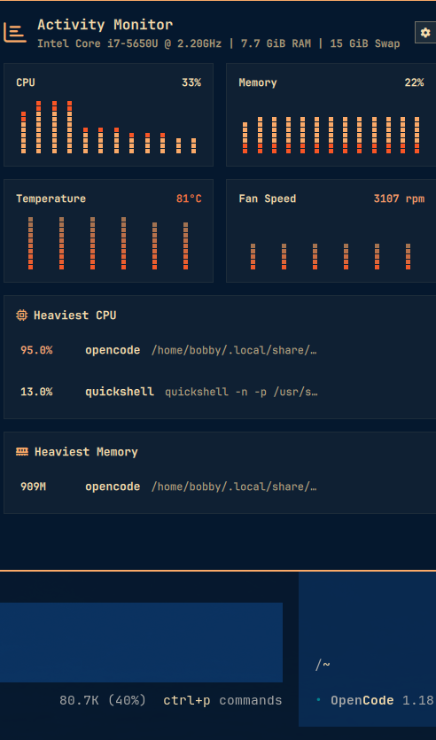
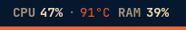

# Activity Monitor

A system activity monitor for the Omarchy bar. CPU, memory, GPU, temperature, and
fan are read straight from `/proc` and `/sys` and rendered as sleek icon
readouts; one click opens a keyboard-driven panel with live history graphs, the
current heaviest processes, and the idle apps you can reclaim.




## Features

- **Bar readout** — four display modes (`icons`, `compact`, `full`, `labels`),
  right-click to cycle, with figures that warm toward the theme's urgent colour
  as load and temperature climb.
- **Persistent thermals** — CPU temperature and fan RPM stay in the bar whenever
  a reading exists, so nothing important is hidden behind a click.
- **Live history graphs** — a 2x2 grid of rolling 60-second windows: CPU and
  memory load on the first line, temperature and fan speed on the second, all
  drawn as the same square-pixel columns. CPU tints each column by
  **user / system / iowait** and memory by **apps / cache / buffers**, so the
  breakdown is visible without a legend cluttering the cards. Buffered
  continuously in the background, so the panel opens already populated.
- **Process lists** — Heaviest CPU (anything above the CPU threshold), Heaviest
  Memory (anything above the memory threshold), and Idle Apps (the reclaimable
  GUI apps), one row each with the highlighted metric, the app name, and the
  full command line. Thresholds keep the lists short: a quiet machine shows few
  or no rows instead of padding, and an empty list says exactly that — the CPU
  list reports "No process is over N% core right now." and the memory list
  reports "No process is over N MiB resident right now.". `topProcessCount`,
  `cpuThresholdPct`, and `memThresholdMib` tune the length.
- **Quiet, on your own processes** — rows belonging to the OS keep a faint
  tinted background and never carry actions; your own rows stay plain until you
  hover, when a subtle **Quit** (SIGTERM) / **Force** (SIGKILL) pair appears
  with a consent prompt. The panel re-surveys after an action.
- **In-panel settings** — a drawer that lives in the panel: mode, which items
  the bar shows, memory format, temperature unit and format. No config file
  surfing.
- **No daemon, no privileges** — reads `/proc` and `/sys`, uses system sensors,
  and never polls in a way that would stall the shell.

## Install

```sh
omarchy plugin add https://github.com/modib/omarchy-activity-monitor.git --enable
```

Place it wherever you like and restart the shell:

```sh
omarchy bar move modib.activity-monitor --section right --after omarchy.tray
omarchy restart shell
```

The plugin finds this machine's sensors on its own — nothing to configure.

## Usage

- **Left click** — opens the panel (or runs `clickCommand` if configured).
- **Right click** — cycles `icons` → `compact` → `full` → `labels`.
- **Middle click** — resamples immediately.
- **Hover** — a tooltip with the click actions and a live telemetry summary.

### The panel

The panel is keyboard-driven and anchored to the widget:

- **Header** — the resolved CPU model and the RAM/Swap totals, with a gear that
  opens the in-panel settings drawer (`s` also toggles it).
- **History graphs** — CPU + Memory side by side on the first line,
  Temperature + Fan speed on the second, the last 60 seconds, all in matching
  square-pixel columns. CPU stacks user/system/iowait and Memory
  apps/cache/buffers by tint, so the breakdown reads at a glance without a
  legend row.
- **Graphics metrics** — card name, load, temperature, VRAM meter, power,
  fan, and core clock (only when a card is present).
- **Heaviest CPU / Heaviest Memory / Idle Apps** — capped lists of the moment's
  heaviest consumers. OS rows are tinted read-only; hovering your own rows
  reveals **Quit** / **Force**.
- **Keyboard** — `Escape` closes, `Tab`/`Shift+Tab` switch panels, `r` resamples,
  `c`/`f` toggle °C/°F.

### The four bar readouts

 `icons` — glyph + figure per item; the
default.

 `compact` — glyph + vertical gauge,
readable without reading a digit.

 `full` — the same, plus CPU and GPU
temperature.

 `labels` — each label welded to its
figure.

## What it reads

| | Source | Shown |
|---|---|---|
| Memory | `/proc/meminfo` | used against total, measured with `MemAvailable` so reclaimable page cache is not counted as used |
| CPU load | `/proc/stat` | jiffie deltas between samples, `iowait` counted as idle — the same arithmetic `top` and `btop` use |
| CPU clock | `/proc/cpuinfo` | mean across every thread |
| CPU temperature | `hwmon` | die/package sensor, picked by scoring (`k10temp` `Tdie`/`Tctl`, `coretemp` `Package id 0`, `zenpower`, ThinkPad, ARM SoC, then `acpitz`) |
| System fan | `hwmon` or EC platform device (`fan*_input`) | RPM, whenever a reading exists |
| GPU | its own `sysfs` counter | load, edge temperature, VRAM, board power, fan, core clock |
| GPU (NVIDIA) | `nvidia-smi` | the same telemetry, polled on the same interval |
| Load average | `/proc/loadavg` | 1/5/15 minute |
| Processes | [`proc-probe`](proc-probe) survey | Heaviest CPU, Heaviest Memory, and Idle Apps |

## How it samples

Sensor paths are located once at load by [`hw-probe`](hw-probe) — a small shell
script, because working out *which* files a machine exposes means globbing
`hwmon` and matching labels, and every vendor names its sensors differently.
After that the widget reads the resolved files directly with blocking `FileView`
reads of a few KB each, which is what makes a two-second interval reasonable for
something that runs for the life of your session.

Process accounting is the exception — there is no single file, it is a few
hundred `/proc/<pid>/stat` directories. [`proc-probe`](proc-probe), bash with no
external calls in the hot loop, takes two snapshots a second apart, computes
per-process CPU the way `top` does (delta against the whole machine's tick
count), and emits the three tables as a small TSV report. Its output replaces
the panel's lists atomically.

`blockAllReads` is set on those views deliberately: without it `reload()` is
asynchronous and `text()` returns the *previous* tick's contents, so every
readout lags a full interval.

See what the probe found on this machine:

```sh
~/.config/omarchy/plugins/modib.activity-monitor/hw-probe | jq
```

A sensor missing from that output is one this machine does not expose, and the
panel renders a dash rather than a zero that looks like real data.

## What counts as "idle"

The reclaim list only ever offers user-owned GUI applications: a process counts
when it owns a window on the compositor. To appear in the Idle Apps table it must
meet *all* of these at the moment of the survey:

- owned by the desktop user (uid matches yours)
- has a display connection (`DISPLAY` or `WAYLAND_DISPLAY` in its environment)
- using at most **1%** of a core over the sample window (`HW_IDLE_CPU`)
- holding at least **150 MiB** resident (`HW_IDLE_MEM_MIB`)
- **not** the currently focused window
- **not** on the protect list below

So a long-open, unfocused browser qualifies the moment it drops under the CPU
ceiling — a browser that just loaded a tab (4-5% core) does not. There is no
timeout: "idle" is a point-in-time snapshot, not something that accrues.

`proc-probe` keeps an auditable protect list of things an optimizer must never
offer to take down — the compositor and shell themselves, the audio and
notification stacks, `systemd` units, portals, dbus, terminals, and network
helpers. Kernel threads (children of `kthreadd`) never appear at all. The quit
and force actions are plain `SIGTERM`/`SIGKILL` on the pid, launched from the
shell, shown only for your own processes and only while you hover the row, and
are only reachable after an in-panel confirmation that expires on its own.

## Settings

Settings live in this widget's entry in `~/.config/omarchy/shell.json`, or are
set from the command line:

```sh
omarchy bar set modib.activity-monitor mode full
omarchy bar set modib.activity-monitor fahrenheit true --json
```

| Key | Type | Default | Description |
|---|---|---|---|
| `mode` | string | `"icons"` | `"icons"`, `"compact"`, `"full"`, or `"labels"`. |
| `itemsOrder` | array/string | `"gpu,cpu,ram,cpu-temp,fan"` | Sequence of telemetry items in the top bar. |
| `showGpu` | bool | `true` | Show GPU load (hidden automatically if no card exists). |
| `showCpu` | bool | `true` | Show CPU load. |
| `showCpuTemp` | bool | `true` | Show the CPU temperature cell. |
| `showGpuTemp` | bool | `false` | Show GPU temperature in the bar. |
| `showRam` | bool | `true` | Show memory usage. |
| `showFan` | bool | `true` | Show the fan RPM cell when a readable fan exists. |
| `ramFormat` | string | `"used/total"` | `"used/total"`, `"used"`, `"percent"`, `"free"`, or `"available"`. |
| `tempFormat` | string | `"degree-unit"` | `"degree-unit"`, `"degree"`, `"unit"`, `"unit-lower"`, or `"bare"`. |
| `fahrenheit` | bool | `false` | Temperatures in °F instead of °C. |
| `percentPad` | string | `"none"` | `"none"`, `"zero"`, `"lead"`, or `"trail"`. |
| `showGauges` | bool | `true` | Show vertical capsule gauges. |
| `showValues` | bool | `false` | Put figures beside gauges in `compact`/`full` modes. |
| `gpuIcon` | string | `"󰾲"` | Glyph marking the GPU figure. |
| `cpuIcon` | string | `""` | Glyph marking the CPU figure. |
| `tempIcon` | string | `""` | Glyph marking the temperature figure. |
| `gpuTempIcon` | string | `"󰔏"` | Glyph marking the GPU temperature figure. |
| `ramIcon` | string | `""` | Glyph marking the memory figure. |
| `fanIcon` | string | `"\uDB80\uDE10"` | Glyph marking the fan figure. |
| `iconSize` | int | `0` | Glyph size in pixels; `0` follows the bar's icon font. |
| `refreshIntervalSec` | int | `2` | Seconds between samples. |
| `gpu` | string | `"auto"` | `"auto"`, a card index, or a name substring. |
| `warnPercent` | int | `70` | Load where figures start warming. |
| `criticalPercent` | int | `90` | Load where figures reach full urgent. |
| `warnTempC` | int | `75` | Temperature (°C) where figures start warming. |
| `criticalTempC` | int | `90` | Temperature (°C) at full urgent red. |
| `clickCommand` | string | `""` | Command for left click; empty opens the panel. |
| `monitors` | array/string | `[]` | Connector names to draw on; empty draws on all. |
| `processProbeIntervalSec` | int | `8` | Seconds between process surveys. |
| `topProcessCount` | int | `5` | Max rows per list in the panel (capped at 5). |
| `cpuThresholdPct` | int | `10` | CPU% floor for the Heaviest CPU list. |
| `memThresholdMib` | int | `200` | Resident-size floor (MiB) for Heaviest Memory. |

## IPC

Methods are reachable through `omarchy-shell`:

```sh
omarchy-shell modib.activity-monitor open       # open the panel
omarchy-shell modib.activity-monitor close      # close the panel
omarchy-shell modib.activity-monitor toggle     # toggle the panel
omarchy-shell modib.activity-monitor toggleFahrenheit
omarchy-shell modib.activity-monitor cycleMode
omarchy-shell modib.activity-monitor refresh    # force a resample
omarchy-shell modib.activity-monitor status     # full telemetry breakdown
```

## Requirements

- A Nerd Font for the glyphs (Omarchy ships one)
- `bash` for the two probe scripts
- `hyprctl` and `jq` for idle-window detection and the GPU probe
- `coreutils` (`kill`) for the reclaim actions
- `pciutils` (`lspci`) — optional, to name the GPU card in the panel
- `nvidia-smi` — only for NVIDIA cards

No pip packages, no daemon, no elevated privileges.

## Removal

```sh
omarchy plugin remove modib.activity-monitor
```

## License

MIT — see [LICENSE](LICENSE). The original upstream copyright notice is
preserved there.